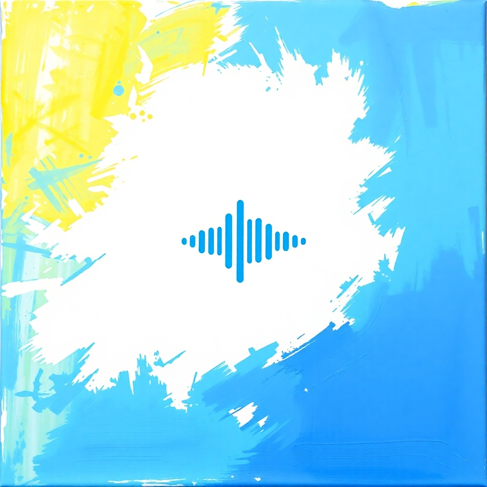

# Tunable

Tunable is an audio recognition system, similar to Shazam, that can accurately identify a song from an audio clip. So the next time you hear some audio and get curious to know which song it is, try Tunable!

## Team Members

- **Aatif Ahmad** – Indian Institute of Technology, Jodhpur ([GitHub](http://github.com/aatifahmad123))
- **Talkeen Ahmad Nomani** – National Institute of Technology, Silchar ([GitHub](http://github.com/TalkeenAhmadNomani))